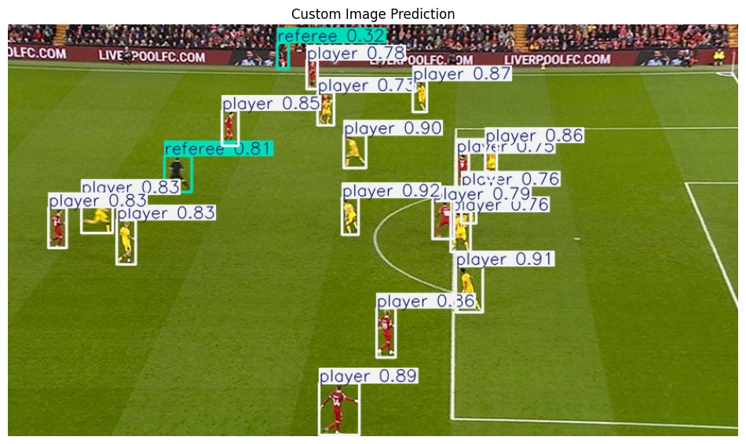
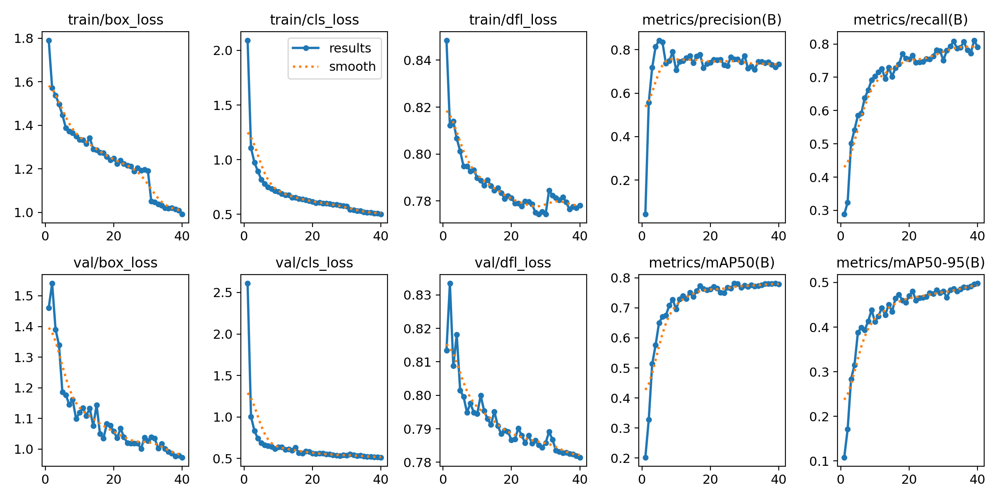
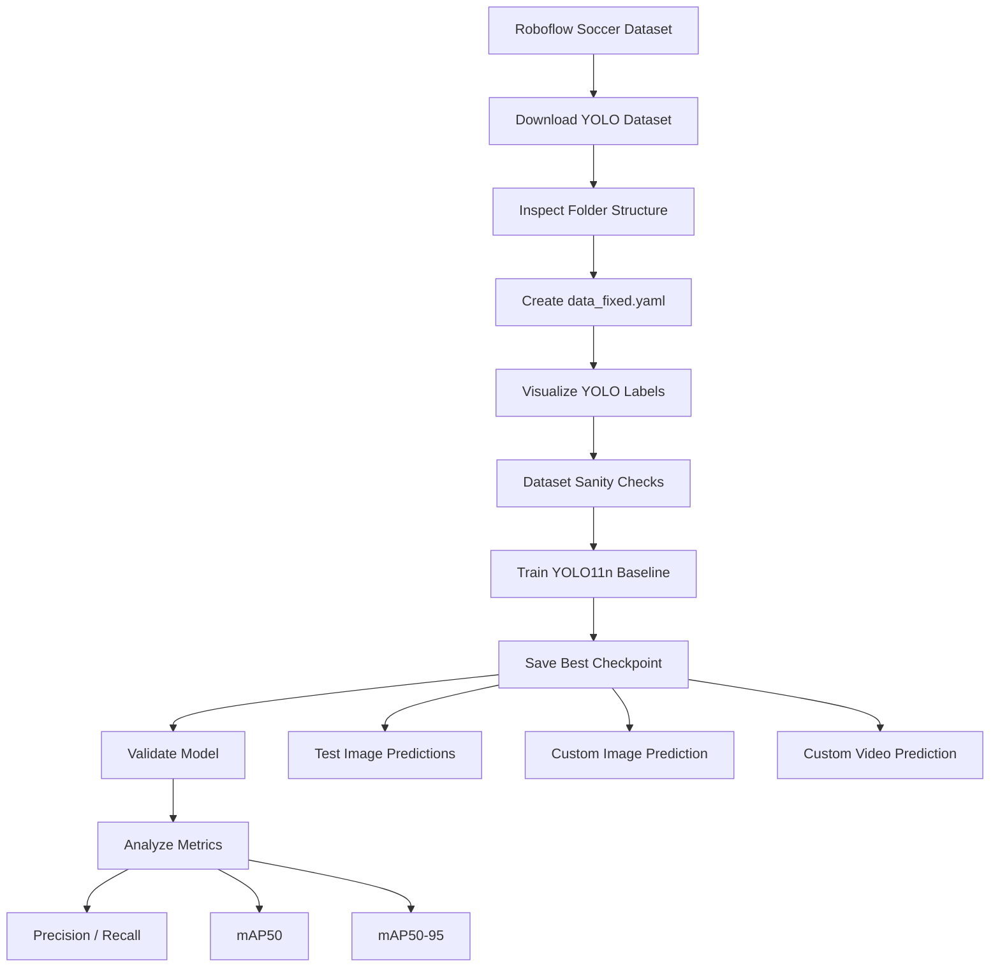

# Football Object Detection with YOLO11n


A complete **football/soccer object detection pipeline** built with **Ultralytics YOLO11n**.  
The project detects key entities in match footage and broadcast-style football images:

- **Ball**
- **Goalkeeper**
- **Player**
- **Referee**

The goal of this project is not only to train a detection model, but also to build a clean computer vision workflow: dataset validation, label inspection, training, evaluation, custom image prediction, video inference, and metrics analysis.

---

## Demo

### Custom Image Prediction



### Training Metrics



### Sample Video Inference

<a href="./assets/goat.mp4">
  
</a>

---

## Project Overview

This project trains a YOLO-based object detector on a football detection dataset exported in YOLO format. The full workflow includes:

1. Installing required libraries
2. Downloading the dataset from Roboflow
3. Checking the dataset folder structure
4. Creating a clean `data_fixed.yaml` file
5. Visualizing YOLO annotations
6. Running dataset sanity checks
7. Training a YOLO11n baseline model
8. Validating the best checkpoint
9. Running predictions on test images
10. Testing different confidence thresholds
11. Running inference on a custom football image
12. Running inference on a custom football video
13. Analyzing class-level detection metrics

---

## Detection Pipeline



---

## Dataset Structure

The dataset follows the standard YOLO detection format:

```text
soccer_detection-1/
├── train/
│   ├── images/
│   └── labels/
├── valid/
│   ├── images/
│   └── labels/
├── test/
│   ├── images/
│   └── labels/
├── data.yaml
└── data_fixed.yaml
```

Each label file contains annotations in YOLO format:

```text
class_id x_center y_center width height
```

All bounding box coordinates are normalized between `0` and `1`.

---

## Classes

```python
class_names = [
    "ball",
    "goalkeeper",
    "player",
    "referee"
]
```

| Class ID | Class Name |
|---:|---|
| 0 | ball |
| 1 | goalkeeper |
| 2 | player |
| 3 | referee |

---

## Model

The baseline model uses **YOLO11n**, the nano version of the YOLO11 family.

```python
model_name = "yolo11n.pt"
```

YOLO11n was selected because it is:

- Lightweight
- Fast to train
- Suitable for experimentation
- Good for baseline object detection projects
- Practical for video inference

---

## Training Configuration

```python
@dataclass
class Config:
    project_name: str = "football_detection_project"
    experiment_name: str = "yolo11n_baseline_img640"

    dataset_path: Path = Path("/content/soccer_detection-1")
    yaml_name: str = "data_fixed.yaml"

    model_name: str = "yolo11n.pt"

    epochs: int = 40
    imgsz: int = 640
    batch: int = 16
    device: int = 0

    patience: int = 10
    workers: int = 2
    seed: int = 42
    plots: bool = True
```

Main training settings:

| Parameter | Value |
|---|---:|
| Model | YOLO11n |
| Image size | 640 |
| Epochs | 40 |
| Batch size | 16 |
| Early stopping patience | 10 |
| Seed | 42 |
| Device | CUDA GPU |

---

## Training

```python
from ultralytics import YOLO

model = YOLO("yolo11n.pt")

results = model.train(
    data="/content/soccer_detection-1/data_fixed.yaml",
    epochs=40,
    imgsz=640,
    batch=16,
    device=0,
    project="football_detection_project",
    name="yolo11n_baseline_img640",
    patience=10,
    workers=2,
    seed=42,
    plots=True
)
```

After training, the best model checkpoint is saved as:

```text
football_detection_project/yolo11n_baseline_img640/weights/best.pt
```

---

## Validation

```python
best_model = YOLO("football_detection_project/yolo11n_baseline_img640/weights/best.pt")

metrics = best_model.val(
    data="/content/soccer_detection-1/data_fixed.yaml",
    imgsz=640,
    batch=16,
    device=0,
    plots=True
)
```

The model is evaluated using standard object detection metrics:

- **Precision** — how many predicted detections are correct
- **Recall** — how many real objects the model finds
- **mAP50** — mean Average Precision at IoU threshold 0.50
- **mAP50-95** — stricter COCO-style metric averaged across multiple IoU thresholds

---

## Results Summary

The training curves show a stable baseline run:

- Training losses decrease consistently
- Validation losses also decrease, suggesting useful learning rather than pure memorization
- Precision stabilizes around a strong baseline range
- Recall improves steadily across training
- mAP50 reaches a strong level for a lightweight YOLO11n model
- mAP50-95 continues improving, showing better localization quality over time

Approximate final behavior from the training curve:

| Metric | Approximate Final Value |
|---|---:|
| Precision | ~0.73 |
| Recall | ~0.80 |
| mAP50 | ~0.78 |
| mAP50-95 | ~0.49 |

These results are a strong starting point for a small baseline model, especially because football broadcast frames include small objects, player overlap, motion blur, and crowded scenes.

---

## Inference on Test Images

```python
pred_results = best_model.predict(
    source="/content/soccer_detection-1/test/images",
    conf=0.25,
    save=True,
    project="football_detection_project",
    name="test_predictions_conf025"
)
```

---

## Confidence Threshold Experiments

Different confidence thresholds were tested to understand the trade-off between missing objects and producing false detections:

```python
for conf in [0.10, 0.15, 0.25, 0.50]:
    best_model.predict(
        source="/content/soccer_detection-1/test/images",
        conf=conf,
        save=True,
        project="football_detection_project",
        name=f"test_predictions_conf{str(conf).replace('.', '')}",
        exist_ok=True
    )
```

The final selected threshold was:

```python
FINAL_CONF = 0.15
```

A lower confidence threshold is useful in football detection because small or partially occluded objects, especially the ball and distant players, may receive lower confidence scores.

---

## Custom Image Prediction

```python
image_results = best_model.predict(
    source="custom_football_image.jpg",
    conf=0.15,
    save=True,
    project="football_detection_project",
    name="custom_image_prediction_conf015",
    exist_ok=True
)
```

The example output shows the model detecting multiple players and referees in a real football match frame.

---

## Custom Video Prediction

```python
video_results = best_model.predict(
    source="goat.mp4",
    conf=0.15,
    save=True,
    project="football_detection_project",
    name="custom_video_prediction_conf015",
    exist_ok=True
)
```

This makes the project useful beyond static image detection and closer to real football analysis workflows.

---

## Repository Structure

Recommended GitHub structure:

```text
football-object-detection-yolo/
├── README.md
├── requirements.txt
├── notebooks/
│   └── football_detection_yolo11n.ipynb
├── assets/
│   ├── metrics.png
│   ├── example.png
│   └── goat.mp4
├── src/
│   ├── train.py
│   ├── predict_image.py
│   ├── predict_video.py
│   └── utils.py
└── .gitignore
```

If you keep the media files inside an `assets/` folder, update the README paths like this:

```md


<video src="assets/goat.mp4" controls width="100%"></video>
```

---

## Installation

```bash
pip install ultralytics roboflow opencv-python matplotlib pandas pillow
```

Or create a `requirements.txt` file:

```text
ultralytics
roboflow
opencv-python
matplotlib
pandas
pillow
```

Then install everything with:

```bash
pip install -r requirements.txt
```

---

## Roboflow API Key Setup

Do **not** commit your Roboflow API key directly to GitHub.

Use an environment variable instead:

```bash
export ROBOFLOW_API_KEY="your_api_key_here"
```

Then load it in Python:

```python
import os
from roboflow import Roboflow

rf = Roboflow(api_key=os.getenv("ROBOFLOW_API_KEY"))
```

For Google Colab, you can use:

```python
from google.colab import userdata
from roboflow import Roboflow

rf = Roboflow(api_key=userdata.get("ROBOFLOW_API_KEY"))
```

---

## Key Learnings

This project helped practice several important computer vision engineering skills:

- YOLO dataset preparation
- Object detection label inspection
- Bounding box visualization
- Model training with Ultralytics
- Validation with detection metrics
- Confidence threshold tuning
- Image inference
- Video inference
- Class-level metric analysis
- Building a portfolio-ready computer vision project

---

## Limitations

The current model is a strong baseline, but there are still limitations:

- Small ball detection can be difficult in wide broadcast shots
- Players may overlap heavily in crowded scenes
- Motion blur can reduce prediction confidence
- Referees may be confused with players if the kit colors are similar
- A larger YOLO model may improve accuracy but require more compute

---

## Future Improvements

Possible next steps:

- Train YOLO11s or YOLO11m for better accuracy
- Increase training epochs
- Add more diverse football match footage
- Improve ball detection with higher-resolution crops
- Compare confidence thresholds quantitatively
- Track players across frames using object tracking
- Add team classification after player detection
- Build a football analytics dashboard
- Use detections for tactical analysis and video content generation

---

## Author

**Celal Ibrahimli**  

---

## License

This project is intended for educational and portfolio purposes.
